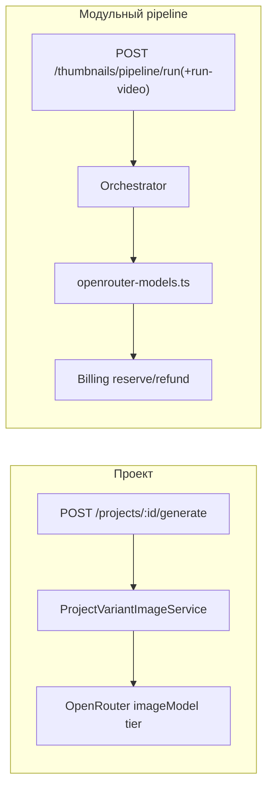

# Backend (NestJS)

API for **ViralThumblify**: Supabase-backed projects, thumbnail variants, template catalog, and **OpenRouter**-powered thumbnail generation.

- **Global prefix:** `/api` (e.g. health is `GET /api/health`)
- **Root:** `GET /` returns a small JSON map (`health`, `docs`) so deploys don’t show “Cannot GET /”
- **OpenAPI:** [http://localhost:3001/api/docs](http://localhost:3001/api/docs) when running locally
- **Env files:** reads `.env` in this folder or repo root `../../.env` (see `app.module.ts`)

## Stack

| Piece | Role |
|--------|------|
| NestJS 10 | HTTP API, modules, validation |
| `@supabase/supabase-js` | JWT verification (anon) + Admin client (service role) |
| `class-validator` | DTO validation + `ValidationPipe` (whitelist, forbid unknown fields) |
| Swagger | `/api/docs` |

## Карта ответственности (кто за что)

| Модуль / слой | За что отвечает |
|---------------|-----------------|
| **ConfigModule** (+ `openrouter.config.ts`, `video-pipeline.config.ts`, `openrouter-models.ts`) | Env: `OPENROUTER_API_KEY`; **Phase 0:** лимит длительности — константа `VIDEO_PIPELINE_MAX_DURATION_SECONDS` в коде; опционально `YOUTUBE_DATA_API_KEY` для YouTube; slug’и — **`openrouter-models.ts`** |
| **SupabaseModule** | Admin-клиент Supabase для БД и Storage с сервера |
| **AuthModule** | Проверка JWT (`SupabaseGuard`), `GET /api/auth/me`, `POST /api/auth/lead-qualification` (квал после входа → CRM + `profiles.lead_qualification_completed_at`) |
| **LeadCrmModule** | **`POST /api/leads/intake`** (публично, throttle) + **`LeadCrmWebhookService`** — единственная отправка JSON в Google Apps Script (`LEAD_INTAKE_WEBHOOK_URL`); используется и из Auth |
| **SupportModule** | **`POST /api/support/contact`** (публично, throttle) → Telegram `sendMessage` (`TELEGRAM_BOT_TOKEN`, `TELEGRAM_SUPPORT_CHAT_ID`); honeypot `company` |
| **HealthModule** | Liveness |
| **StorageModule** | Загрузки и signed URL: проекты, шаблоны, аватары, временное видео для pipeline и итоговые картинки |
| **BillingModule** | Резерв и возврат кредитов: варианты проекта и **`pipeline/run`** (`creditsForThumbnailPipelineRun`); **`POST /api/billing/manual-credit`** (без JWT, секрет `X-Manual-Billing-Secret`) — начисление после оплаты посредником, см. `docs/payments-mvp-email-to-credits.md` |
| **OpenRouterModule** (`@Global`) | Один экземпляр `OpenRouterClient` на всё приложение |
| **ProjectThumbnailGenerationModule** | `ProjectVariantImageService` — картинка для одной строки `thumbnail_variants` (OpenRouter или placeholder) |
| **ProjectsModule** | CRUD проектов; `ProjectGenerationService` — оркестрация N вариантов + биллинг + вызов `ProjectVariantImageService` |
| **TemplatesModule** | Каталог шаблонов, ниши, загрузки в `thumbnail-templates` |
| **AvatarsModule** | `GET/POST/DELETE /api/avatars` — лица в `user-avatars` |
| **VideoThumbnailsModule** | URL parse/meta (`get-video-meta` с `duration_seconds` при Data API key), ingestion, **Phase 0–1** `VideoPipelineDurationGateService` |
| **ThumbnailPipelineModule** | `POST /api/thumbnails/pipeline/run` и `POST /api/thumbnails/pipeline/run-video`: JSON/multipart-пайплайн (VL + Flux в `openrouter-models.ts` → `PIPELINE_STEP_MODELS`) |

Cross-cutting: **HttpExceptionFilter**, **shutdown hooks**.

### Схема потоков (три входа к превью)



**Модели OpenRouter** задаются в одном файле **`src/config/openrouter-models.ts`**: **`OPENROUTER_STACK`** (shared runtime settings) и **`PIPELINE_STEP_MODELS`** (`pipeline/run*`). Секрет — только **`OPENROUTER_API_KEY`** в env. Slug’и перепроверяйте на [openrouter.ai/models](https://openrouter.ai/models).

**extractJsonObject:** один модуль **`src/common/json/extract-json-object.ts`**; `video-thumbnails/lib/json-repair.ts` только реэкспорт для совместимости.

**Идеи по снижению дублирования (по ситуации):** общий helper `requestOpenRouterSingleThumbnailImage` (image+таймаут) уже используется в `pipeline/run` gen/edit и генерации варианта проекта.

### HTTP: два контроллера на пути `projects`

Оба объявлены как `@Controller('projects')`, префикс приложения `/api`:

| Файл | Типичные маршруты |
|------|-------------------|
| `projects.controller.ts` | `GET/POST/...` по самому проекту (список, создание, `GET :id`, `PATCH`, `DELETE`) |
| `thumbnail-variants.controller.ts` | `POST :id/generate`, `GET :id/variants`, `DELETE :id/variants/:variantId` |

Так REST остаётся под ресурсом «проект», а операции с вариантами сгруппированы отдельным контроллером.

## Environment variables

### Required

```env
SUPABASE_URL=https://your-project-id.supabase.co
SUPABASE_ANON_KEY=your_supabase_anon_key
SUPABASE_SERVICE_ROLE_KEY=your_supabase_service_role_key
```

- **Anon key** — `SupabaseGuard` validates the user’s JWT (`auth.getUser`).
- **Service role** — server-side DB/Storage (bypasses RLS); keep secret, never expose to the browser.

### Server / CORS

```env
FRONTEND_URL=http://localhost:3000
```

`FRONTEND_URL` is the default **single** CORS origin. For **лендинг + приложение** на разных доменах задай **`CORS_ORIGINS`** — список через запятую (см. `main.ts`). **Listen port** defaults to **3001** in `src/config/server-defaults.ts`; PaaS may still inject **`PORT`** at runtime (not listed in `.env.example`).

JSON body size limit is **15MB** in `main.ts` (base64 image uploads). If the frontend uses a **host proxy** (e.g. Next rewrites on Vercel), that platform may enforce a **smaller** max request size (~4.5MB on Vercel) — the frontend downscales avatar images before upload to stay under typical limits.

### OpenRouter: модели и сценарии

Slug’и — идентификаторы на [OpenRouter](https://openrouter.ai/models). **`src/config/openrouter-models.ts`:** **`OPENROUTER_STACK`** (shared runtime настройки: `baseUrl`, `appTitle`, `projectGenTimeoutMs`) и **`PIPELINE_STEP_MODELS`** (модульный pipeline шаги). **`getOpenRouterConfig`** отдаёт поля стека вместе с **`OPENROUTER_API_KEY`** из env.

| Сценарий | Эндпоинт / этап | Где задаются модели |
|----------|-----------------|---------------------|
| Картинка варианта проекта | `POST /api/projects/:id/generate` | `getOpenRouterThumbnailImageModel` (tier `default` / `premium`, slug’и заданы в `openrouter-models.ts`) + timeout из `OPENROUTER_STACK` |
| Модульный пайплайн (JSON) | `POST /api/thumbnails/pipeline/run` | `PIPELINE_STEP_MODELS` |
| Модульный пайплайн (video ingest) | `POST /api/thumbnails/pipeline/run-video` | `PIPELINE_STEP_MODELS` |

Без **`OPENROUTER_API_KEY`** генерация вариантов проекта отдаёт **placeholder**; реальные вызовы к OpenRouter требуют ключ.

#### OpenRouter: переменные окружения

| Variable | Role |
|----------|------|
| `OPENROUTER_API_KEY` | Ключ API ([openrouter.ai/keys](https://openrouter.ai/keys)) |
| `FRONTEND_URL` | Используется как `HTTP-Referer` для запросов к OpenRouter (см. `openrouter.config.ts`) |

```env
OPENROUTER_API_KEY=
```

### CRM / leads (optional)

Nest читает из того же корневого **`.env`**. Без URL вебхука эндпоинты квала и публичного intake отвечают успехом, но **не** шлют данные наружу.

| Variable | Role |
|----------|------|
| `LEAD_INTAKE_WEBHOOK_URL` | Google Apps Script Web App URL (`doPost`) — единственное место исходящего запроса в CRM |
| `LEAD_INTAKE_DEBUG` | `1` — подробнее логировать ответы вебхука (по коду сервиса) |

```env
LEAD_INTAKE_WEBHOOK_URL=
LEAD_INTAKE_DEBUG=0
```

### Support / Telegram (optional)

| Variable | Role |
|----------|------|
| `TELEGRAM_BOT_TOKEN` | Bot token from @BotFather |
| `TELEGRAM_SUPPORT_CHAT_ID` | Group or channel id (often negative for supergroups) where the bot may post |

```env
TELEGRAM_BOT_TOKEN=
TELEGRAM_SUPPORT_CHAT_ID=
```

`POST /api/thumbnails/pipeline/run-video` (Bearer, `multipart/form-data`): field `file` **or** `videoUrl`, optional `count` (1–12), `style`, `prompt`, `template_id`, `avatar_id`, `prioritize_face`. Внутри: ingest видео -> `pipeline/run` -> persist project.

`POST /api/thumbnails/pipeline/run` (Bearer, JSON): модульный OpenRouter-пайплайн (always-on). Поля: `user_prompt` (обязательно), опционально `video_url`, `template_reference_data_urls`, `face_reference_data_urls`, `variant_count`, `generate_images`, `prioritize_face`, `base_image_data_url` + `edit_instruction`, `persist_project`. Ответ включает `run_id`, **`credits_charged`**, `analysis`, `image_prompts_used`, `models_used`, `persisted_project`, при `generate_images: true` — `variants[].image_base64`. Модели шагов — **`src/config/openrouter-models.ts`** (`PIPELINE_STEP_MODELS`).

Для YouTube URL backend использует локальный бинарник **`yt-dlp`** (`VIDEO_PIPELINE_YT_DLP_BINARY = 'yt-dlp'`) только чтобы получить прямой video stream URL. Затем `ffmpeg` достаёт реальные кадры, Gemini выбирает лучший кадр, а Flux edit-flow использует этот кадр как **base image** для финальных thumbnails. Если `yt-dlp` не установлен или stream недоступен, pipeline откатывается в режим `text_context_no_video_url` без дорогой raw-video отправки в VL-модель.

**Кредиты для `pipeline/run*`:** в начале запроса резервируется **`1 + (generate_images ? variant_count : 0) + (есть edit ? 1 : 0)`** (анализ VL + до N генераций + один шаг редактирования). При любой ошибке после резерва выполняется **полный возврат** (`refund`). Формула в коде: `creditsForThumbnailPipelineRun` в `billing.service.ts`.

**Rate limiting (по пользователю, после JWT):**

| Маршрут | Окно | Лимит |
|---------|------|--------|
| `POST /api/projects/:id/generate` | 1 мин | 15 |
| `POST /api/thumbnails/pipeline/run` | 1 ч | 8 |
| `POST /api/thumbnails/pipeline/run-video` | 1 ч | 8 |

**Storage signed URL TTL** (seconds) is fixed in **`src/config/server-defaults.ts`** (`DEFAULT_SUPABASE_STORAGE_SIGN_EXPIRES_SEC`), not env.

## Database & Storage

SQL migrations live in the monorepo: **`supabase/migrations/`**. Apply them in the Supabase SQL Editor or via Supabase CLI so tables (`projects`, `thumbnail_variants`, `thumbnail_templates`, `profiles`, …) and Storage policies exist before calling the API.

### `profiles` and generation credits

- **`001`** creates `public.profiles`; **`003_generation_credits.sql`** adds `generation_credits_balance`; **`008_credit_ledger_and_credit_model_cleanup.sql`** adds `generation_credits_total_granted` + `credit_ledger` (defaults **3**).
- New users only appear in **`auth.users`** until a matching **`profiles`** row exists. **`007_profiles_auto_create.sql`** defines **`handle_new_user`** on **`AFTER INSERT ON auth.users`** and **backfills** any existing auth users without a profile.
- If you skipped **007**, the API used to error with *“No profile row for this account”* on reserve credits. The backend now **lazy-inserts** a `profiles` row via the service role when needed, but you should still run **007** in production so the DB stays consistent and triggers work for all new signups.

## Scripts

From **repo root**:

```bash
yarn dev:backend
```

From **`apps/backend`**:

```bash
yarn dev          # nest start --watch
yarn build
yarn start:prod   # node dist/main
yarn lint
```

## Quick API check

```bash
curl -s http://localhost:3001/
curl -s http://localhost:3001/api/health
curl -s -H "Authorization: Bearer <supabase_access_token>" http://localhost:3001/api/auth/me
# Публичный лид в CRM (тело как в Google Sheets / Apps Script `doPost`):
# curl -s -X POST http://localhost:3001/api/leads/intake -H "Content-Type: application/json" \
#   -d '{"lead_session_id":"…","channel_url":"https://youtube.com/…","funnel_stage":"landing"}'
# curl -s -X POST http://localhost:3001/api/support/contact -H "Content-Type: application/json" \
#   -d '{"email":"you@example.com","message":"Hello","source":"landing"}'
# curl -s -X POST http://localhost:3001/api/billing/manual-credit -H "Content-Type: application/json" \
#   -H "X-Manual-Billing-Secret: $MANUAL_BILLING_WEBHOOK_SECRET" \
#   -d '{"email":"buyer@example.com","external_payment_id":"test_001","credits":50}'
```

Use Swagger at `/api/docs` for authenticated routes (`Authorize` with the same Bearer token).

## Deployment note

This app is a **long-running Node HTTP server** (`listen`). Host it on platforms meant for that (Railway, Render, Fly.io, Cloud Run, a VPS), not as a substitute for Vercel serverless functions. Set the same env vars in the host; point the frontend’s `NEXT_PUBLIC_BACKEND_URL` (or your Next rewrite target) at the deployed API origin.

## Monorepo

For full-stack setup (frontend env sync, Turborepo), see the root **`README.md`**.
