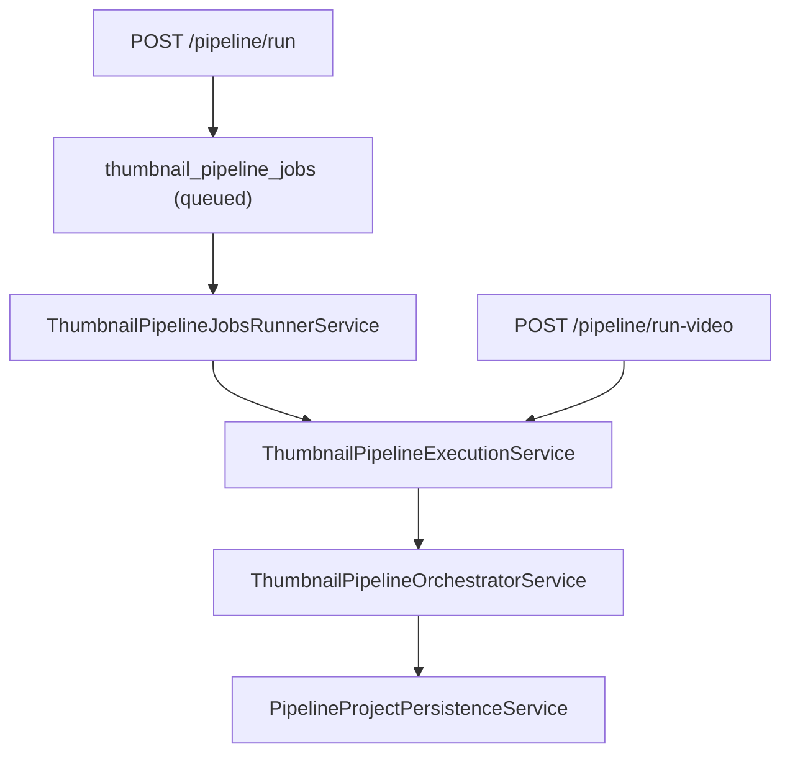

# Thumbnail Pipeline Module

Pipeline-first thumbnail generation module.

## Endpoints

- `POST /api/thumbnails/pipeline/run` (JSON, async enqueue)
- `POST /api/thumbnails/pipeline/run-video` (multipart, sync)
- `POST /api/thumbnails/pipeline/jobs` (JSON, async enqueue)
- `GET /api/thumbnails/pipeline/jobs/:jobId` (poll status/result)

Completed pipeline runs can persist generated variants into:

- `projects`
- `thumbnail_variants`
- Supabase Storage (`project-thumbnails`)

## Internal flow

1. `run-video` path: optional ingest (`VideoIngestionService`) + duration gate, then direct execution.
2. `run` path: enqueue async job and return `job_id`; runner claims and executes in background.
3. `ThumbnailPipelineExecutionService` coordinates request-shaping and final response assembly for both paths.
4. `ThumbnailPipelineOrchestratorService` remains the core business engine:
   - reserve/refund credits
   - analyze prompt/video/reference context (VL step)
   - build prompts
   - generate/edit images
5. Optional persistence via `PipelineProjectPersistenceService`.
6. Temp video cleanup for multipart ingest path.

## Key files

- `thumbnail-pipeline.controller.ts` — transport + request wiring
- `services/thumbnail-pipeline-jobs.service.ts` — DB-backed job queue primitives
- `services/thumbnail-pipeline-jobs-runner.service.ts` — async runner loop + lease timeout handling
- `services/thumbnail-pipeline-execution.service.ts` — shared execution path used by sync + async entry points
- `services/thumbnail-pipeline-orchestrator.service.ts` — main business flow
- `services/pipeline-project-persistence.service.ts` — DB + storage persistence
- `dto/thumbnail-pipeline-run.dto.ts` — JSON contract
- `dto/thumbnail-pipeline-run-video.dto.ts` — multipart video contract
